# Validation of Pathwise Estimators in DDES Gradient Analysis
Overall, the results validate the paper's main conclusions: the PATHWISE estimator offers better estimation quality and scalability than REINFORCE or SPSA, although the absolute values sometimes differ.
## Section 5.1
  | Reproduced Fig. 8 | Paper Fig. 8 |
  |--------------------|---------------|
  | 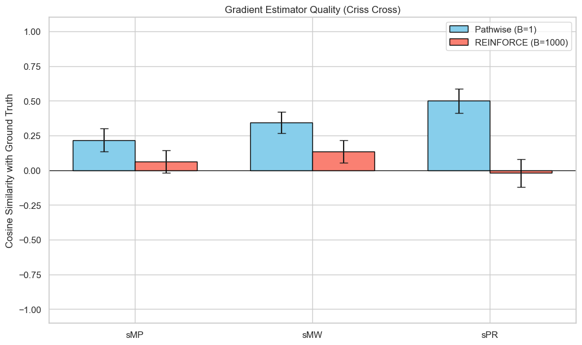 | 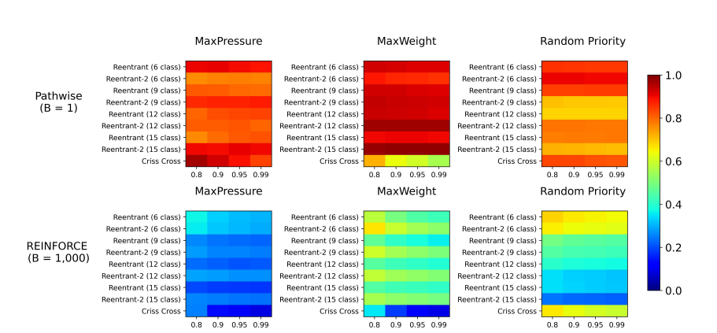 |

- Comparison
  - Trend: The results faithfully reproduce the performance hierarchy of the paper. The PATHWISE estimator (blue) consistently achieves higher cosine similarity with the "true" gradient than REINFORCE (red/orange) across all three policies (sMP, sMW, sPR).
  - Magnitude: There is a notable difference in absolute values.
  - Paper: PATHWISE reaches a similarity close to 1.0 (perfection) and REINFORCE between 0 and 0.3.
  - The result: PATHWISE peaks around 0.50 (for sPR) and REINFORCE is close to 0 or 0.15.

## Section 5.2
Setting: PATHWISE v.s. REINFORCE, multi-class single-server, $\mu_{1j}=1+\epsilon j$, with a simple softmax policy that’s proportional to $\theta$, $\pi_\theta^{sPR}(x)_i=softmax(\theta_i)$, h = 1 for all queues. According to cmu rule, queues with a larger index should have a larger policy score $\theta_j$. These results are already using normalized gradients with a fixed step size.

- Figure 9 (Left panel):
    - 5 classes, 50 gradient steps, alphas = [0.01, 0.1, 0.5, 1.0], results averaged over all alphas; pho = 0.99, horizon = 1000
    - epsilon = 0.1 (as in the paper):
      - PATHWISE (B=1) and REINFORCE (B=100) both learns the pattern ⇒ larger index, larger policy score. PATHWISE assigns strictly increasing scores (from -1.8 to +1.5) corresponding to the queue indices (1 to 5).
        1. Different from fig 9(left) in the paper, where REINFORCE fails to learn the pattern
        2. Still shows that PATHWISE is more efficient than REINFORCE in the sense that it achieves the correct result (maybe even more significantly) with a lot fewer rollout trajectories
           
        | Reproduced Fig. 9.1 | Paper Fig. 9.1 |
        |--------------------|---------------|
        | 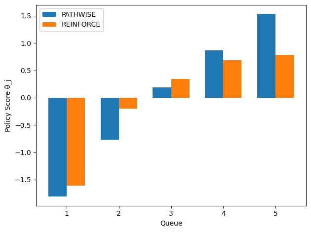 | 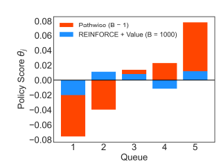 |

        
      - PATHWISE (B=1) v.s REINFORCE (B=1):
        
        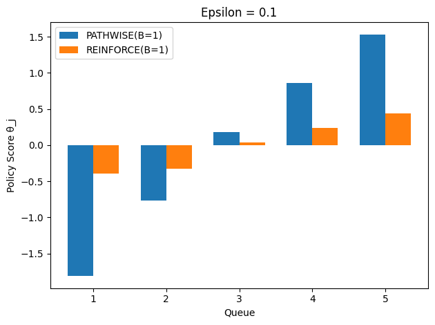
      
    - epsilon = 0.01, as gap gets smaller, queues are more similar to each other, thus harder to learn the correct policy:
        | PATHWISE (B=1) and REINFORCE (B=100) | PATHWISE (B=1) and REINFORCE (B=1) |
        |--------------------|---------------|
        | 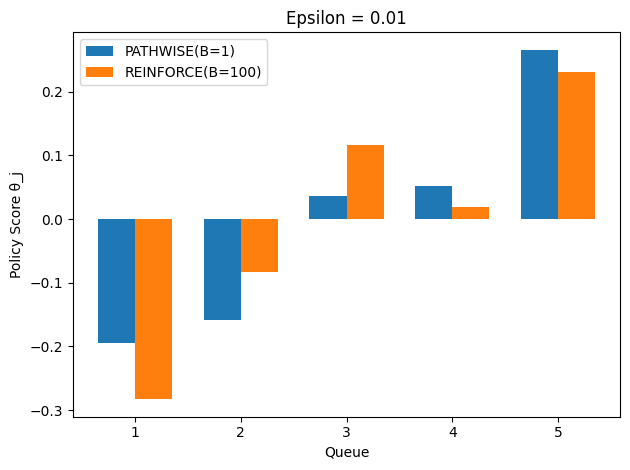 | 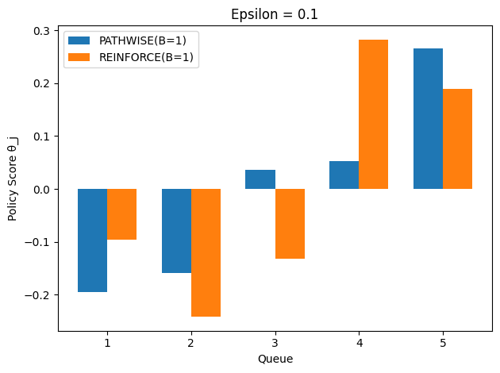 |
      
    - Conclusion: PATHWISE learns the cmu-rule better and more efficiently than REINFORCE, with results more significant for smaller gaps (harder tasks).

- Figure 9 (Right panel):
  - 10 classes, 20 gradient steps, epsilon = [0.01, 0.05, 0.1, 0.5, 1], alphas = [0.01, 0.1, 0.5, 1.0]; pho = 0.95, horizon = 1000
  - PATHWISE(B=1) v.s. REINFORCE(B=100)
    - No significant difference in performance of PATHWISE(B=1) & REINFORCE(B=100), unlike stated in the paper. However, reaching similar performances with much fewer trajectories still shows that PATHWISE is more efficient than REINFORCE.
    - General trend of increasing costs for harder tasks (small $\epsilon$) is logical.
 
    | Reproduced Fig. 9.2 | Paper Fig. 9.2 |
    |--------------------|---------------|
    | 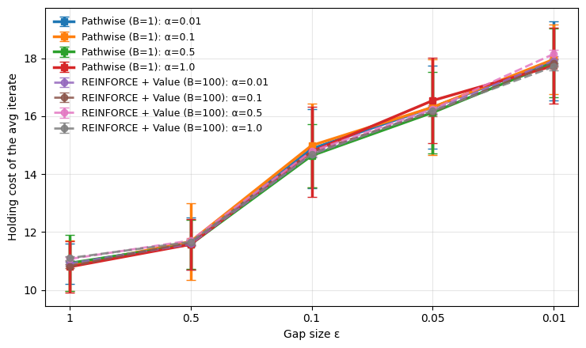 | 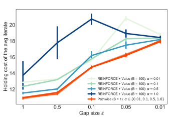 |

  - Different B for REINFORCE
    - PATHWISE(B=1) significantly outperforms REINFORCE(B=1). PATHWISE seems more robust to hyperparameters.

    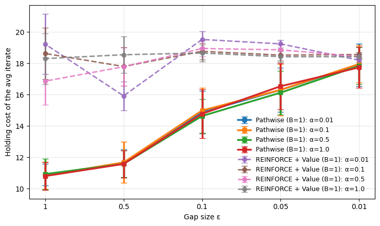
    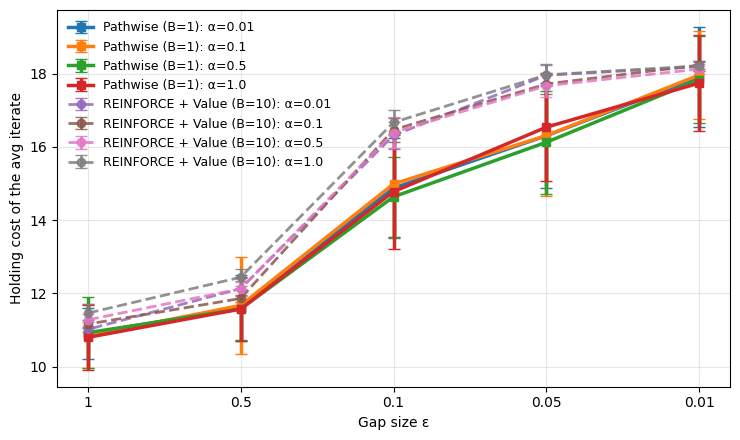
    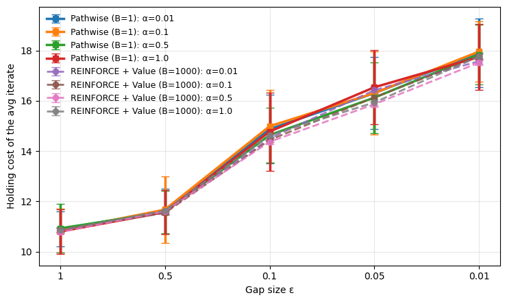
    
  - Conclusion: the optimization performance of the PATHWISE estimator is highly similar across step-sizes, and uniformly outperforms REINFORCE with different step-sizes α.

## Section 5.2 (Continued): Error-Bar Analysis for Figure 9.1 and Ablation Studies for Figure 9.2

### Figure 9.1 Error-Bar Analysis (5-class, 1000 runs x 4 alphas)

Setting: 5 queue classes, 50 gradient steps, alphas = [0.01, 0.1, 0.5, 1.0], rho = 0.99, horizon = 1000. The cmu rule prescribes that queue j (with service rate $\mu_{1j} = 1 + \epsilon j$) should receive a strictly increasing policy score $\theta_j$: prioritize faster-service queues more.

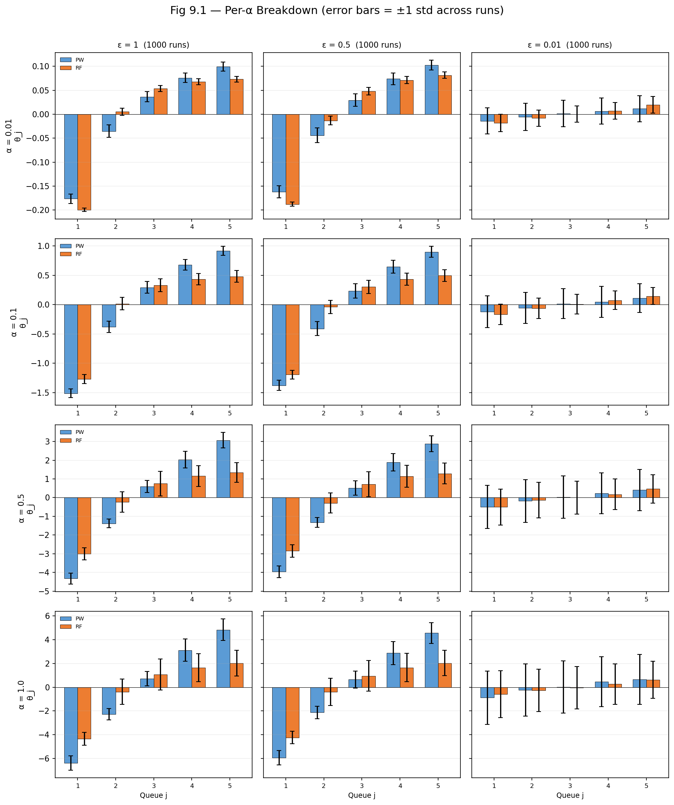

- Both methods seem to learn the correct ordering, with the pattern more pronounced for easier tasks (larger $\epsilon$). Although PATHWISE being able to learn the correct ordering with only 1 rollout while REINFORCE needs 100, means PATHWISE is more efficient.

### Figure 9.2 Ablation Studies (10-class, 100 runs x 4 alphas per setting)

Setting: 10 queue classes, baseline = {K=20 gradient steps, T=1000 horizon, $\rho$=0.95, n=10 classes}. Each ablation varies one hyperparameter while holding the rest at baseline. PATHWISE uses B=1, REINFORCE uses B=100 with a learned value baseline. Results are shown per alpha(100 runs per ablation setting).

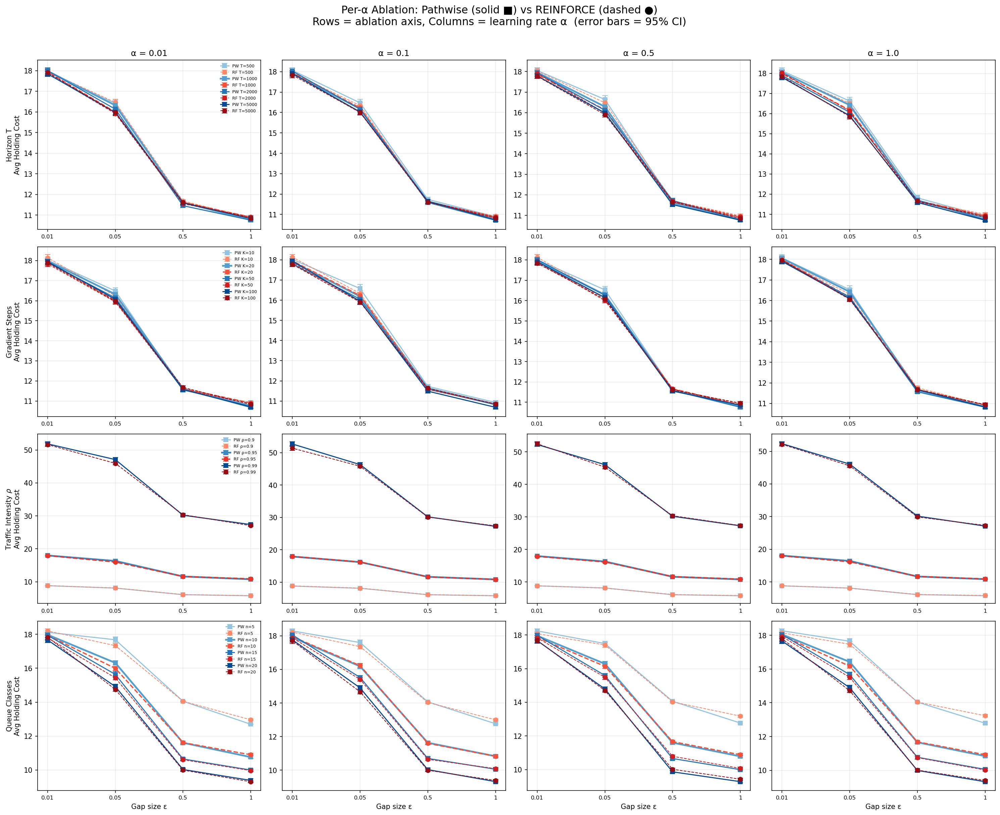

- Traffic intensity and number of classes have the largest effect on average cost.
- However, all these hyperparameter settings don't change the fact that performance degradation is similar across PATHWISE and REINFORCE. The two basically achieve the same performance.
  
### Adaptive/Normalized step size rules

Tested 8 step rules across both gradient-normalized and adaptive families, each with 4 learning rates, 4 gap values, and 100 independent trials (K=20 & 100 gradient steps). 

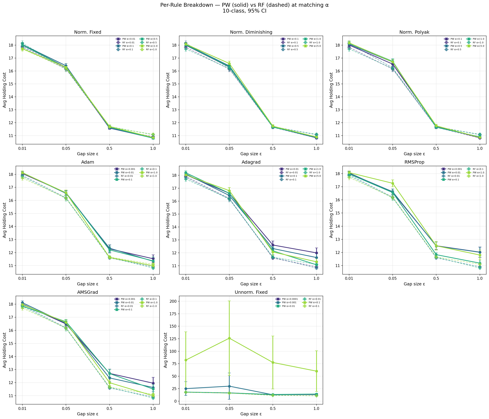

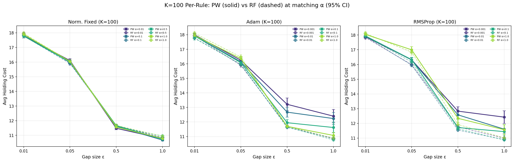

At each alpha, PATHWISE (solid) and REINFORCE (dashed) are nearly indistinguishable, with no step rule producing a meaningful separation:

The performance degradation as $\epsilon$ decreases remains similar for both PATHWISE and REINFORCE. PATHWISE appears slightly more robust to changes in $\epsilon$ when using Adam and RMSProp, but tends to perform slightly worse than REINFORCE on easier tasks.

## Section 5.3
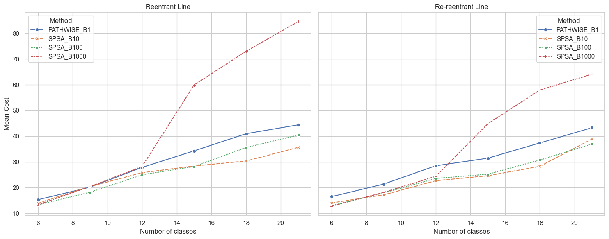
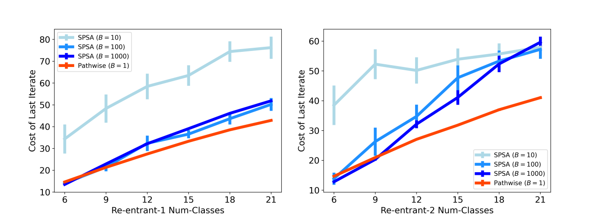
Overall, the experiment validates the paper’s primary hypothesis: that standard finite-difference methods (SPSA) scale poorly with problem dimension compared to the PATHWISE estimator. However, the results regarding low-sample SPSA differ interestingly from the paper's specific observations.
1. The "Collapse" of High-Sample SPSA (Strong Validation)

The most significant finding in the reproduction matches the paper's most critical claim: simply adding more data to a zeroth-order method (SPSA) does not solve the dimensionality problem.
- The Paper Claims: "Even with B=1000 trajectories, SPSA is unable to effectively optimize the buffer sizes for larger networks". The paper argues that performance scales poorly with problem dimension.
- The Results: This is perfectly reproduced. In the JSON data for the largest network (reentrant_7.yaml, 21 classes), SPSA_B1000 explodes to a mean cost of 84.55.
- Comparison: In contrast, PATHWISE_B1 maintains a much lower cost of 44.42. This confirms that in high-dimensional spaces (21 buffers to tune), the brute-force approach of using 1000 trajectories per step fails to find a descent direction effectively, whereas the gradient-based PATHWISE succeeds with 1000x less data.
2. PATHWISE vs. SPSA Efficiency
- The Paper Claims: "PATHWISE with only a single trajectory is able to outperform SPSA with B=1000 trajectories for larger networks".
- The Results: Confirmed.
  - In the Re-reentrant line (Right Panel, 21 classes), PATHWISE (B=1) has a cost of 43.30, while SPSA (B=1000) has a cost of 64.10.
  - Visually, in the figure_11.png, the blue line (PATHWISE) is consistently and significantly below the red dashed line (SPSA B=1000) for all networks larger than 12 classes.
3. The Divergence: SPSA B=10 Stability

There is a notable difference between the results and the paper regarding the performance of SPSA with small batch sizes (B=10).
- The Paper Claims: SPSA with B=10 is "much less stable," leading to "much higher costs" because it often sets buffer sizes to zero, failing to stabilize the queue. In the paper's Figure 11 (left), the SPSA B=10 line is shown exploding upwards, similar to the B=1000 line.
- The Results: In the experiment, SPSA_B10 (orange 'x' line) actually performs very well, often beating PATHWISE.
  - For re-reentrant_7 (21 classes), the SPSA_B10 achieves the lowest mean cost of 38.88, compared to PATHWISE's 43.30.
  - The plot shows SPSA_B10 and SPSA_B100 staying low and stable, unlike the paper's plot where low-batch SPSA fails.
