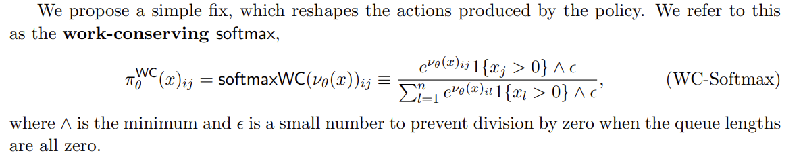
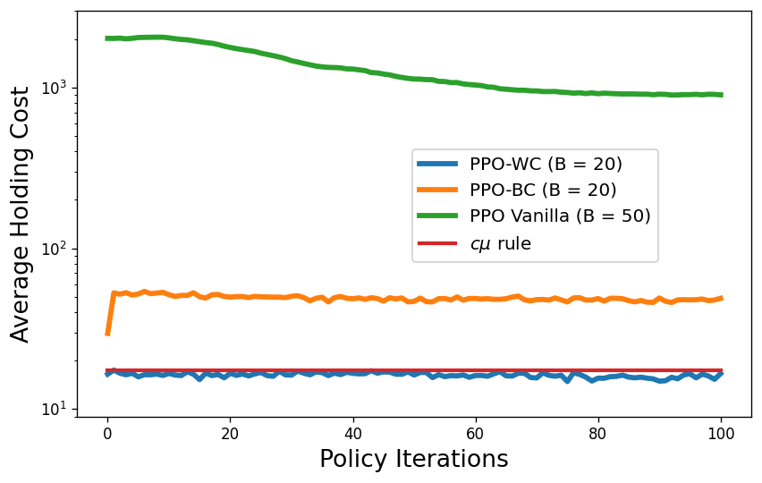
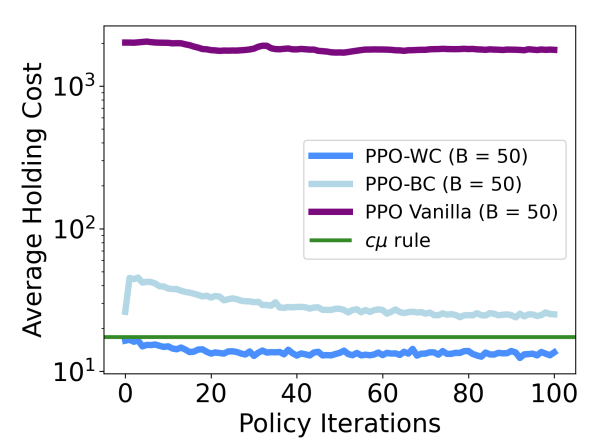

## Section 6 ##
- PPO-WC:
    - Q: Is this equation in section 6 accurate?
      
       
      
        - work-conserving: assigns a probability of zero to empty queues
            1. if $\epsilon>0$, then when all queue lengths=0, $1 \{ x_l>0 \} \wedge \epsilon =0$, doesn’t prevent division by zero (0/0).
            2. if $\epsilon<0$, if only $x_j = 0$, then numerator $\pi_\theta^{WC}(x)_{ij} \wedge \epsilon \neq0$, defies WC.        
      
    - Code uses
      
      if not all queues are empty; Otherwise, assign equal weights to each feasible queue.

- Setting: Reentrant_2 config file in codebase, i.e., Reentrant-1 (6 classes, 2 servers) in the paper.

- Hyperparameters: 50000 episodes, 100 policy iterations. Actor number as shown in picture. (Used fewer actors in reproduction to save running time, which might cause the results to vary slightly.)

  | Reproduced Fig. 12 | Paper Fig. 12 |
  |--------------------|---------------|
  |  |  |

- Conclusion: The reproduced results generally match those reported in the original paper. PPO-WC > cmu-rule > PPO-BC > PPO Vanilla. 
    - Though plain PPO seems to improve at first, it gets stuck at a bad policy with a high average holding cost and an average queue-length of around 150.
    - Behavior cloning provides a much better initialization, but fails to improve over the cµ-rule. 
    - With the work conserving softmax, even the randomly initialized policy is capable of stabilizing the network – achieving an equivalent cost as the cµ-rule – and is able to outperform the cµ over the course of training.
    - (?) But Behavior cloning and work conserving doesn't seem to have an significant improving/cost decreasing phase like in the paper.
